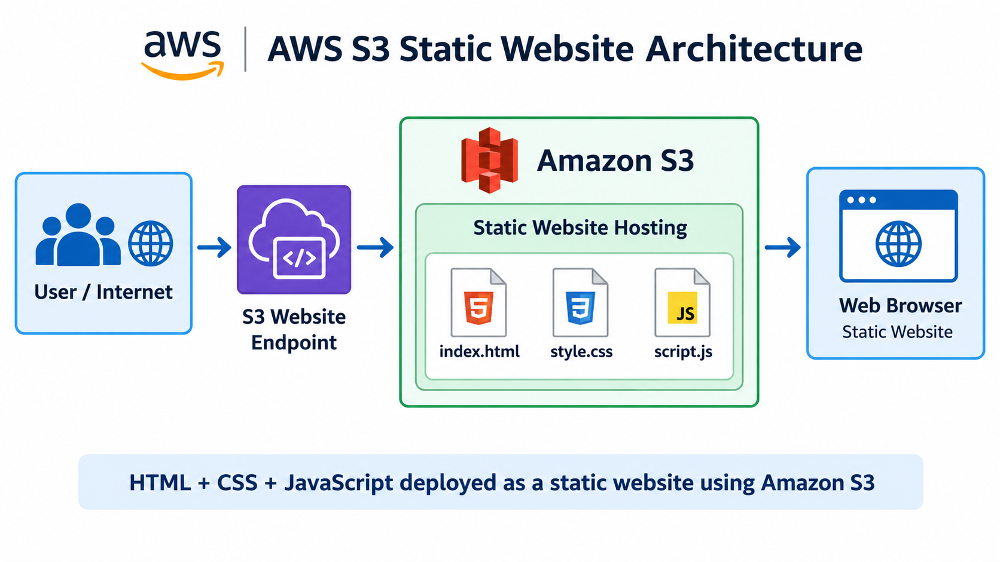
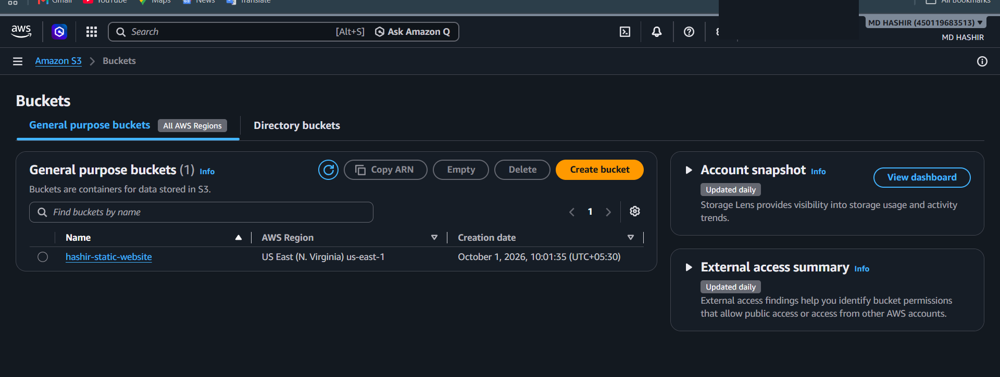
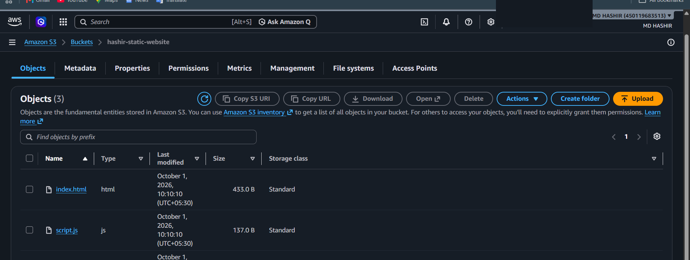
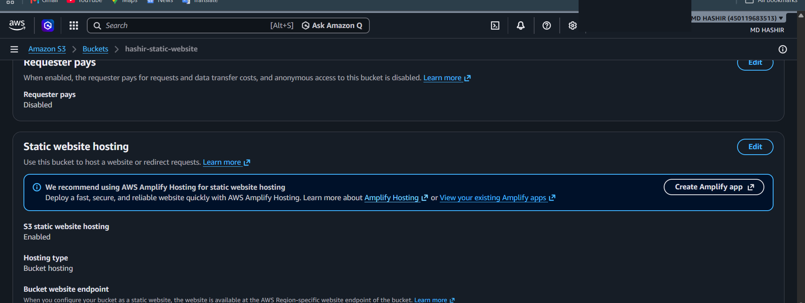
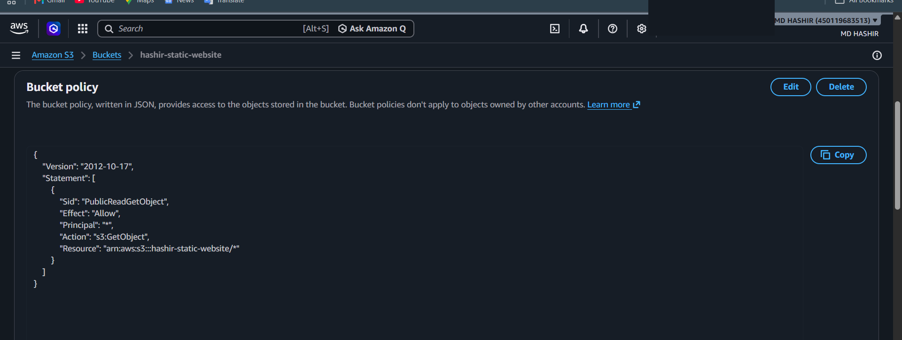
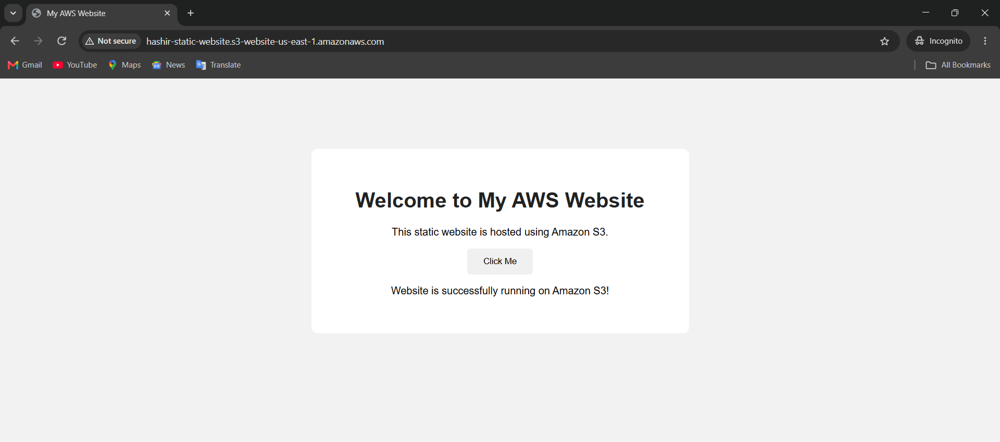

# AWS S3 Static Website Architecture

A college cloud project demonstrating how to deploy a static HTML, CSS, and JavaScript website using **Amazon S3 Static Website Hosting**.

## 1. Project Objective

The objective of this project is to deploy a simple static website using Amazon S3 and make it accessible through an S3 website endpoint.

The project demonstrates:

- Creating an Amazon S3 bucket
- Uploading static website files
- Enabling S3 Static Website Hosting
- Configuring public read access with an S3 bucket policy
- Accessing and testing the deployed website through the S3 website endpoint

## 2. AWS Service Used

This project intentionally uses **Amazon S3 only** for the cloud implementation.

| Service | Purpose |
|---|---|
| Amazon S3 | Stores and serves the static website files |
| S3 Static Website Hosting | Publishes the static website through an S3 website endpoint |

No EC2, Lambda, CloudFront, RDS, VPC, or other AWS services are used.

## 3. Architecture



### Architecture Flow

**User / Internet → S3 Website Endpoint → Amazon S3 Static Website Hosting → Web Browser / Static Website**

The S3 bucket contains the three website files:

- `index.html`
- `style.css`
- `script.js`

The `index.html` file acts as the entry point. The CSS and JavaScript files provide the styling and client-side functionality.

## 4. Configuration Details

### S3 Bucket Configuration

| Configuration | Value |
|---|---|
| AWS Service | Amazon S3 |
| Bucket Name | `hashir-static-website` |
| AWS Region | `us-east-1` — US East (N. Virginia) |
| Hosting Type | Bucket hosting |
| Static Website Hosting | Enabled |
| Index Document | `index.html` |
| Uploaded Files | `index.html`, `style.css`, `script.js` |
| Storage Class | Standard |
| Requester Pays | Disabled |

### Website Endpoint

```text
http://hashir-static-website.s3-website-us-east-1.amazonaws.com
```

### Bucket Policy

Public read access was configured using an S3 bucket policy with:

```text
Effect: Allow
Principal: *
Action: s3:GetObject
Resource: arn:aws:s3:::hashir-static-website/*
```

This allows visitors to retrieve the objects required by the static website.

> **Security note:** This project intentionally uses public read access because the assignment demonstrates S3 static website hosting through the S3 website endpoint. Do not upload private or sensitive information to this bucket.

## 5. Website Files

The following files were uploaded to the S3 bucket:

```text
index.html
style.css
script.js
```

### `index.html`

Contains the main HTML structure and content of the website.

### `style.css`

Contains the styling used to control the website's appearance.

### `script.js`

Contains the client-side JavaScript functionality used by the website.

## 6. Deployment Procedure

1. Created an S3 bucket named `hashir-static-website`.
2. Selected the `us-east-1` (US East — N. Virginia) region.
3. Uploaded `index.html`, `style.css`, and `script.js`.
4. Enabled **S3 Static Website Hosting**.
5. Configured `index.html` as the index document.
6. Configured the S3 bucket policy to allow `s3:GetObject` access.
7. Opened the generated S3 website endpoint in a web browser.
8. Verified that the static website loaded successfully.

## 7. Screenshots / Evidence

### 7.1 S3 Bucket

The S3 bucket `hashir-static-website` was created in the `us-east-1` region.



### 7.2 Uploaded Website Files

The bucket contains `index.html`, `style.css`, and `script.js`.



### 7.3 Static Website Hosting

Static website hosting is enabled using bucket hosting, with `index.html` configured as the website entry document.



### 7.4 Bucket Policy

The bucket policy grants public `s3:GetObject` access to objects in the website bucket.



### 7.5 Deployed Website

The website was successfully accessed through the S3 website endpoint.



## 8. Testing Results

The deployed website was tested through the generated S3 website endpoint.

| Test Case | Expected Result | Actual Result | Status |
|---|---|---|---|
| S3 bucket creation | Bucket is available in `us-east-1` | Bucket created successfully | PASS |
| Website files upload | Three website files are present | `index.html`, `style.css`, and `script.js` are present | PASS |
| Static website hosting | S3 website hosting is enabled | Hosting is enabled | PASS |
| Index document | `index.html` loads as the home page | Website home page displayed | PASS |
| Website endpoint | Endpoint should open the website | Website opened successfully | PASS |
| CSS loading | Website styling should be applied | Styling displayed correctly | PASS |
| JavaScript functionality | JavaScript should execute in the browser | Website JavaScript functionality was available | PASS |

## 9. Result

The static website was successfully deployed using **Amazon S3 Static Website Hosting**. The website is accessible through the S3 website endpoint, and the HTML, CSS, and JavaScript files are served from the S3 bucket.

## 10. Conclusion

This project demonstrates the deployment of a static website using Amazon S3 without requiring a traditional web server. Amazon S3 provides object storage and static website hosting, allowing the HTML, CSS, and JavaScript files to be served directly to users through an S3 website endpoint.

---

### Project Architecture Summary

```text
User / Internet
       |
       v
S3 Website Endpoint
       |
       v
Amazon S3
       |
       v
Static Website Hosting
       |
       +--> index.html
       +--> style.css
       +--> script.js
       |
       v
Web Browser / Static Website
```

**HTML + CSS + JavaScript deployed as a static website using Amazon S3**
